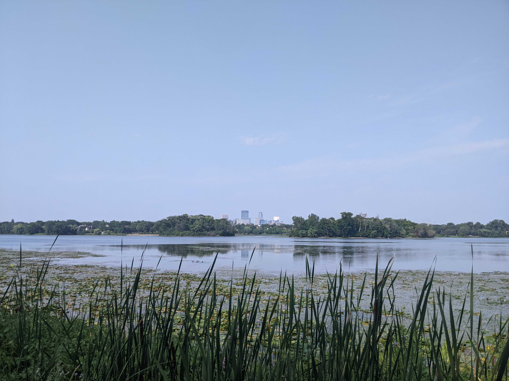
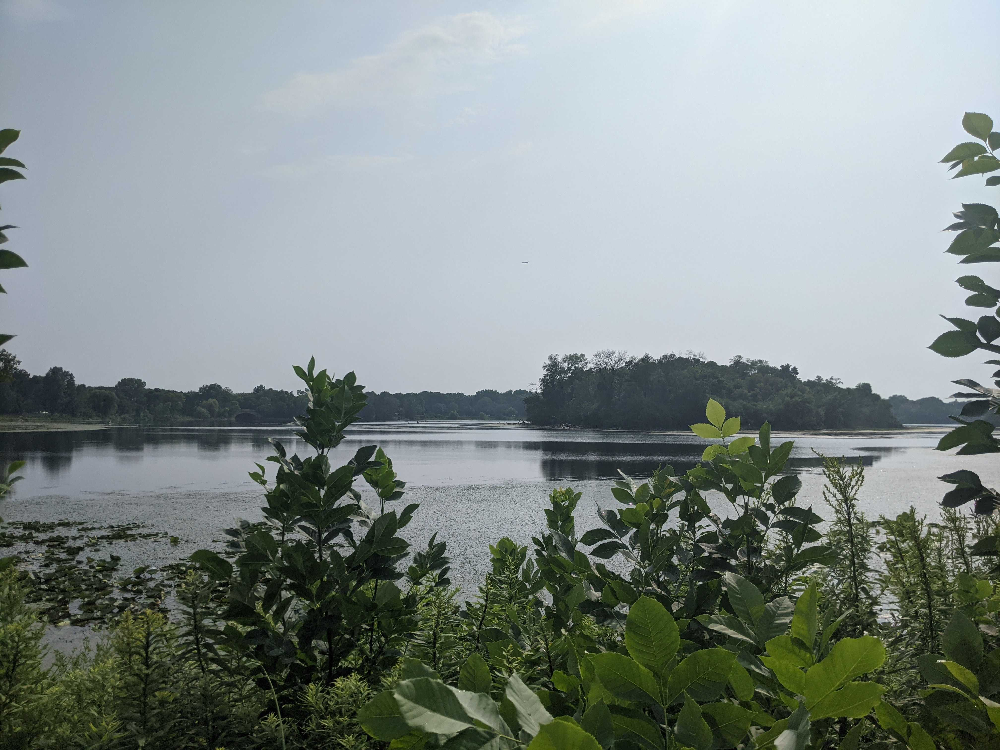

# Parks

## Chain of Lakes \(Cedar Lake, Lake of the Isles, Bde Maka Ska, Lake Harriet\)


**Overall Rating**: 5/5


* Pretty amazing
* Walking path + Bike path all around them
* Similar to NYC's Prospect Park in that you'd have no idea you were in the middle of the city if you were out on the water

#### Lake of the Isles

* The "isles" in the middle sort of shield the other side of the lake so it looks even more natural:

