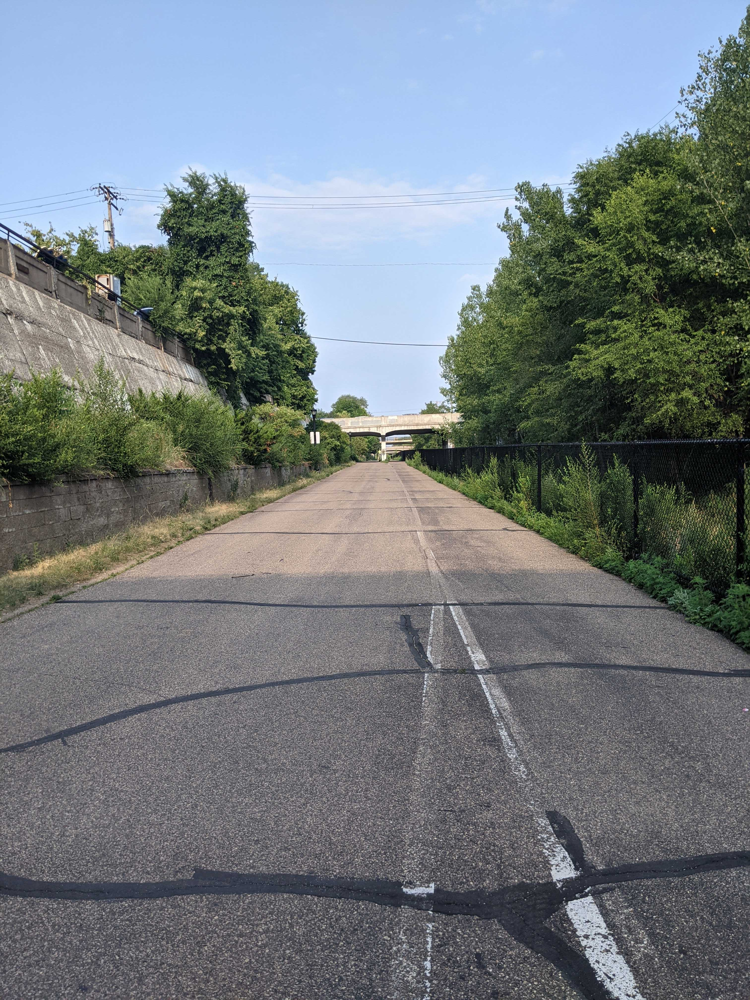

# Transportation

## Light Rail


**Overall rating**: 4.5/5


* Public transit agency: "Metropolitan Transit" or "Metro"
* Two lines
  * Green line \(East / West\)
    * Goes from downtown Minneapolis to downtown St. Paul
  * Blue line \(North / South\)
    * Goes from downtown Minneapolis to Mall of America
    * Stops by airport
    * A little bumpy, but no worse than a NYC subway
    * Costs $2.00 for 2.5 hours of access

## Bus

TBD

## Bike


**Overall rating**: 5/5


### Significant amounts of **quality** bike infrastructure ✅ 

* Bike lanes along every major road, or a shoulder that's wide enough to bike on
* Cars seem to be more used to bikes than other cities where cars rule \(ie, Syracuse\)
* It's used significantly by people from all backgrounds

#### Minneapolis Greenway

* A bike highway through the middle of Minneapolis that's sunken down
* Really solid piece of infrastructure
* Has "on ramps" and "off ramps" which are not all obvious to find...

### Bike rental 😐

* Called "NiceRide"
* Run behind the scenes by lyft
* It works, but it's a little expensive
  * 30 minute e bike ride = around $10
* Pretty equivalent to bike rentals in other cities \(citibike, bixi bike, biketown, etc\)
* **Anyone who lives here should own their own bike.**

